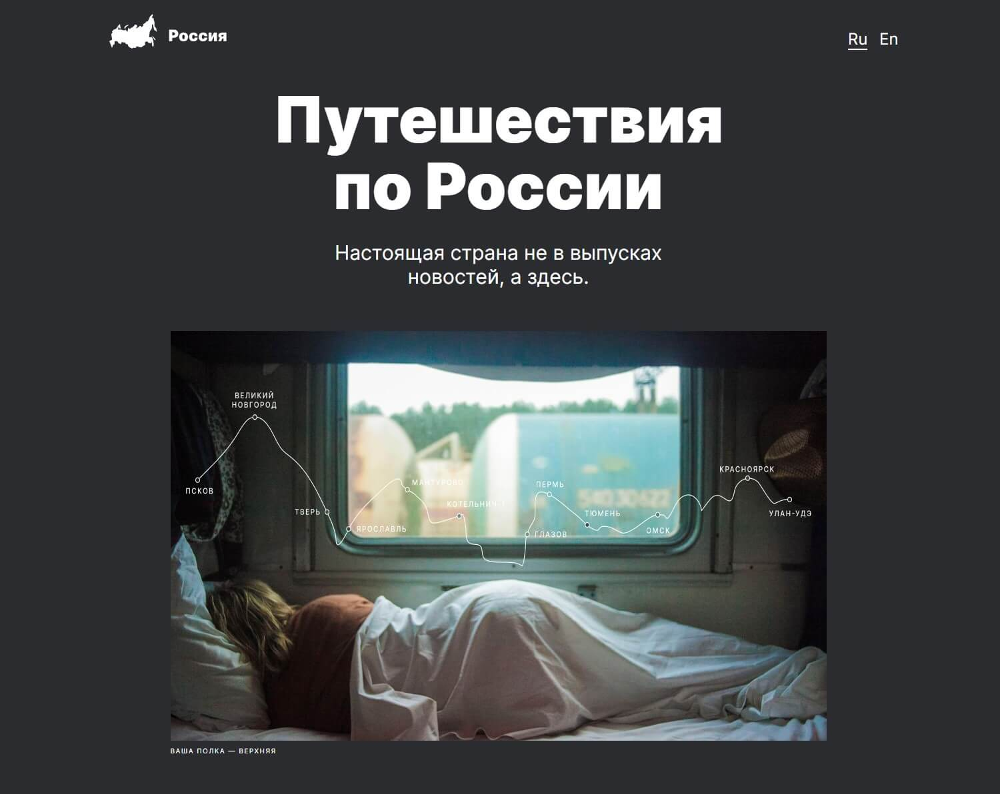

# Проект: Путешествие по России

### Проект создан в процессе обучения в Яндекс Практикуме. Страница создана по макету в Figma. При создании использовались:

- Perfect-pixel концепция;
- Flex-box;
- Grid-Layout;
- семантические теги;
- БЭМ;
- Эффекты
- Директивы @media для создания адаптивности.

---

### [Ссылка на макет Figma.](https://www.figma.com/file/5S2WSbEFL6awjVWJ0NWL8Q/Sprint-3_-Russia-_-desktop-mobile?node-id=28503%3A0)

### [Ссылка на проект.](https://h1ze.github.io/russian-travel/)
